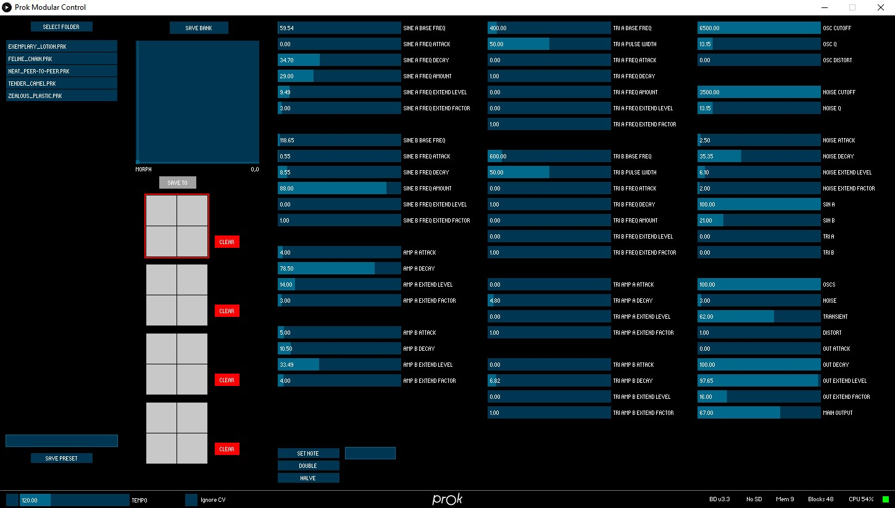

# Prok Drums Editor

[Mac Beta](https://github.com/Normalised/ProkDrumsEditor/releases)

[Windows Beta](https://github.com/Normalised/ProkDrumsEditor/releases)

Release Notes
-------------

0.1.Beta.1

Initial beta release.

Guide
-----

First connect the module to your computer via USB then launch the editor application.

When the editor connects to the module you will see the module select screen.

Arrows at the top are for re-ordering them so you can make it match your rack.

Click the Red leds to morph to that square.

Click the trigger button to trigger the module.

Click the SD card slot to select a folder of preset files on your computer and the first 16 in the folder will be sent to the module.

Click anywhere else on the panel to open the editor for that module.

- Patch Save / Load         (Far Left)
- Morph Control             (Second Column Top)
- Module Storage Controls     (Second Column)
- Parameter Editing         (Middle Section)
- Control Bar             (Bottom section)

## Morph Control

The morph control is the same as turning the X and Y knobs on the module itself. The knob positions will be overridden by the editor control.

## Storage Controls

The storage controls show you the 4 available quads. 
Clicking on a square will change to the appropriate quad and patch.

If a square is highlighted in green this means that it already has a custom patch saved onto the SD card.

To save the sound you currently hear into a bank slot, first click the SAVE TO button and then the bank and slot square you wish to store the patch into.

If there is an SD card present and the module was booted into SD card mode (by holding the trigger button) then the corresponding slot will highlight green to show that the file has been saved to the SD Card.

If you save a patch into a quad without the SD card being present that patch will be overwritten in the modules memory but it will only be temporary and will reset when the module is restarted.
Parameter Editing
Just click or drag a slider to edit any parameter.

Be very careful with the SHELF parameters as they can easily be pushed beyond the edges of their reasonable ranges and can be very loud and distorted.

Oscillators can be tuned by using the note entry textfield and Set Note button at the bottom.
The current oscillator will be highlighted green.
You can retune all of the oscillators at once by typing in a comma separated list of midi note numbers into the textfield. E.g. 48,51,54,57,60,63 and pressing the Set Note button.

The Set Note control only supports whole note values, not decimals.

## Control Bar

### Metronome

Click the square to activate the editors internal metronome. Note the timing is not accurate at all, its just there to keep triggering the sound whilst editing. 

### Ignore CV 

Activating this will stop any CV input from having effect, both triggers and X / Y controls.

NOTE : Pressing space will trigger the module.
Save To Computer
This will write all of the patches to a folder on your hard drive.
These can then be copied onto an SD card to be used by the module.

## Presets
Single patches can be saved and loaded from your computer using the preset controls on the right.

Click save preset to store the current parameters as a preset. You can type a name in the textfield for the preset file or leave it blank to have a name autogenerated for you.

NOTE : All drum types use .prk files but they can only be loaded into the correct module.

